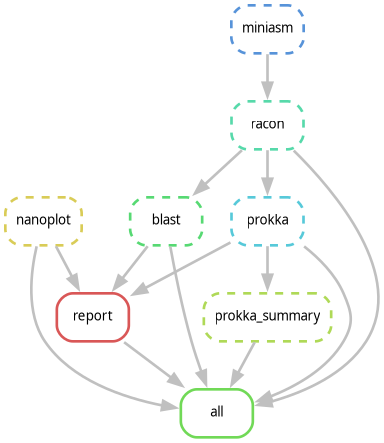
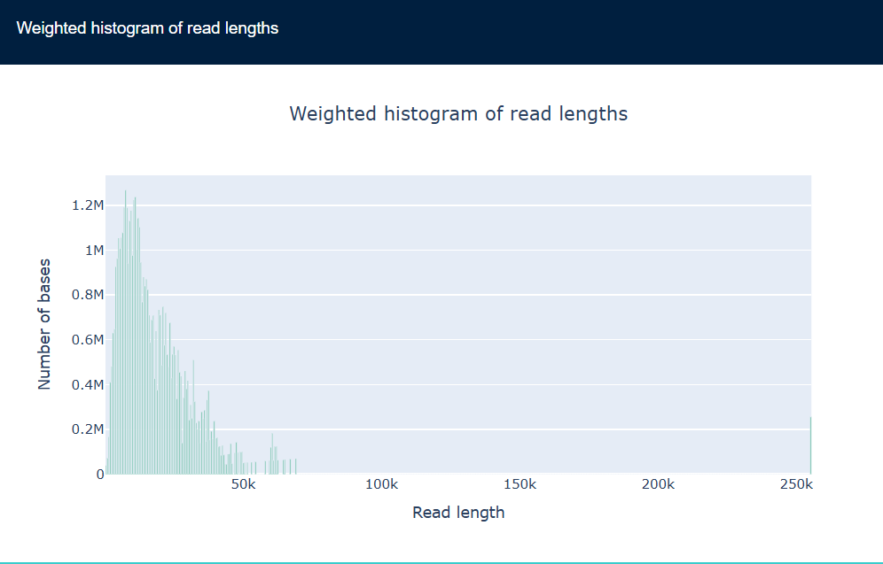
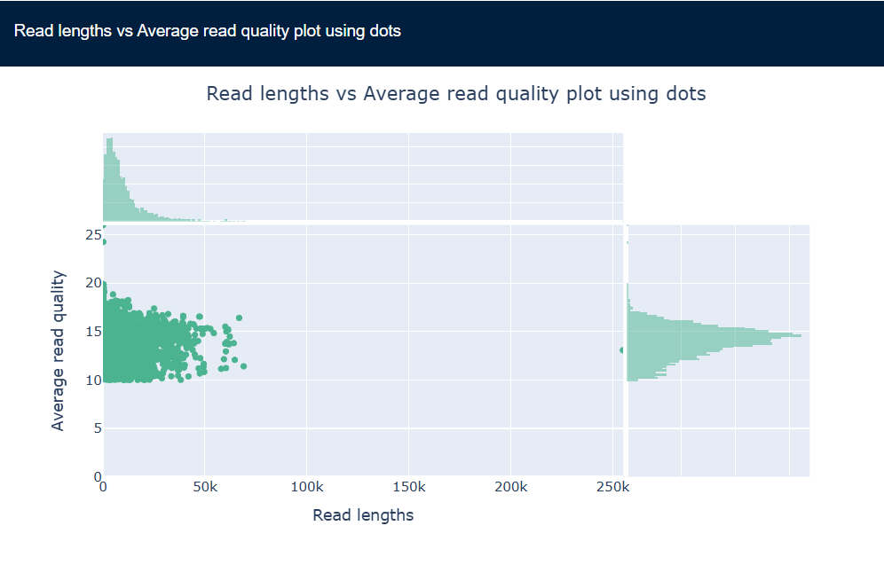
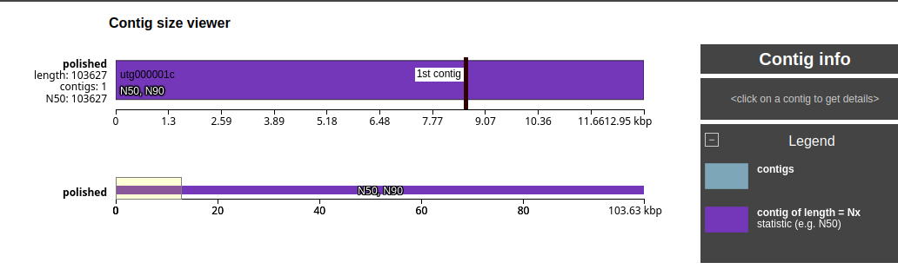

# Nanopore Genome Assembly Report

## Objective
To assemble, quality assess, characterize, and annotate a genome from Nanopore long-read sequenicng data using a Snakemake workflow

## Methods
Pipeline implemented in Snakemake with reproducible Conda environment.

## Workflow:

1. Raw read QC - NanoPlot
2. Overlap generation - Minimap2
3. Assemby - Miniasm
4. Polishing - Racon
5. Assembly QC - QUAST
6. Contig Characterization - BLAST
7. Annotation - Prokka

## Results

### Read QC

**Mean read length:** 9,677 bp
**N50:** 14,392 bp

### Assembly QC (QUAST)

| Metric | Value |
|--------|-------|
| Number of contigs  | 1 |
| Total length | 103,627 bp |
| GC content | 48.78% |
| N50 | 103,627 bp |
| L50 | 1 |
| Ambiguous bases | 0 |

- Interpretation: A near-complete single-contig assembly was generated.

### BLAST Characterization

|Contig    |Best BLAST Hit                       |Identity (%)  |Align.Length (bp)|E-value|Bit Score|
|----------|-------------------------------------|--------------|-----------------|-------|---------|
|utg000001c| Vibrio phage 1.024.O._10N.261.45.F8 |  99.978      |  35,994         |  0.0  |  66,417 |

- Interpretation: The top BLAST hit spans ~36kb of the 103 kb assembly, suggesting partial similarity to a related Vibrio phage genome.

### Prokka Annotation

- contigs: 1
- bases: 103627
- CDS: 153
- tRNA: 3 

- Interpretation: Compact viral-like genome architecture.

## Discussion

- The pipeline successfully assembled a single contig of 103,627 bp from Nanopore reads.
- BLAST analysis identified strong similarity to a Vibrio phage over a ~36kb region with 99.97% identity.
- Prokka annotation predicted 153 CDS and 3 tRNA genes, suggesting a compact viral genome structure.
- Overall, results are consistent with a phage-associated genome assembly. 
